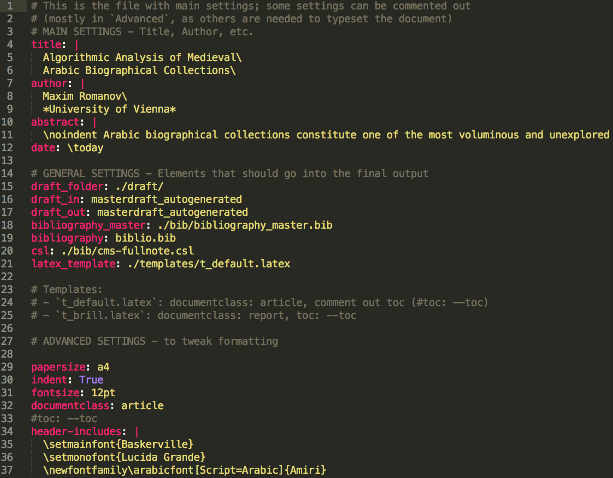
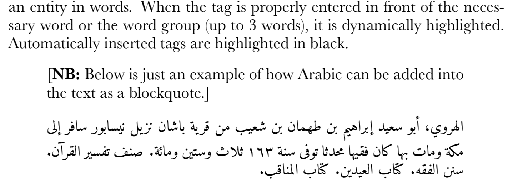

# Kitābaŧ wRoutine 1.0

A simple markdown-based workflow for sustainable academic writing with some features for the field of Arabic and Islamic Studies (transliteration, AH date conversion, Arabic support). To test, if everything necessary is installed on you machine (see, **Requirements** below), run `python wRoutine.py` from `Terminal` on Mac (or `command line` on Windows). If everything is installed, a PDF file should be generated and open. To start your own project, simply replace `*.md` files in the `draft` folder with your own, and change the `_settings.yml` accordingly (see below).

## Features

### Features: General

- [Atom] a nice and simple, yet sufficiently robust interface (<https://atom.io/> seem to fit nicely)
- [wRoutine] atomized drafting: easy inclusion/exclusion of sections into/from the master draft;
	- draft can be atomized into sections and subsections, all stored as separate files;
	- all sections of the main piece must be stored in the `draft` folder; if you work on a book project, you can also create subfolders for each chapter;
	- the filenames must begin with `0` (zero) and end with `.md`; change file names to change their order in folders and subfolders. The initial `0` can be changed into some other character (or, better, prepended with `z`) in order to be excluded from the final draft;
	- all files that begin with `0` and end with `.md` will be joined—in alphabetical order—into the master draft in the main folder of the project; subfolders for chapters should also start with numbers, which helps to arrange all folders into the desired order. The names of subfolders and files can be changed in order to achieve the desired order of sections within the final document. For example, `000 Introduction.md` will be always before `010 Subject of the Study.md`; prefix `z` can be added to exclude a file from the final draft (`z` will also push an excluded section to the bottom of the list in Atom (and any file browser)).
- [markdown] explicit logical markup with *markdown*, a simple text encoding scheme;
	- see the following two tutorials on the basic principles of [*markdown*](https://programminghistorian.org/en/lessons/getting-started-with-markdown) and [*sustainable academic writing*](https://programminghistorian.org/en/lessons/sustainable-authorship-in-plain-text-using-pandoc-and-markdown);
	- standard and expanded pandoc markdown is used for the following (see [Pandoc User’s Guide](http://pandoc.org/MANUAL.html) for specific details): 
		- images and illustrations with captions;
		- cross-references to sections, images, tables within the text; you will need `pandoc-crossref` for crossreferences: <https://github.com/lierdakil/pandoc-crossref>; easiest on Mac: `brew install pandoc-crossref`);
		- footnotes;
- [Atom; bibTeX] automatic citation insertion form bibliography files;
- [bibTeX; Pandoc] bibliography and citation styles (Pandoc);
- [Pandoc; XeLaTeX] automatic generation of desired formats (e.g., PDF, HTML, DOCX, etc.); PDF requires [Xe]LaTeX engine to be installed on the machine; at the moment, only PDF conversion is fully implemented.

## `_settings.yml` File 

Below is the contents of the `_settings.yml` file, which include all the necessary metadata and settings.



### MAIN SETTING

These are the standard YAML parameters from Pandoc markdown; they will be collected and inserted into the main draft (together with other parameters from GENERAL and ADVANCED settings). `title` and `author` must be included; `abstract` and `date` are optional.

- `title:` required (?) 
- `author:` required (?) 
- `abstract:` optional
- `date:` optional

### GENERAL SETTINGS

- `draft_folder:` path to the atomized draft (required)
- `draft_in:` name for the main draft, in markdown format (required)
- `draft_out:` name for the output file, currently in PDF only (required)
- `bibliography_master:` path to the master bibliography (required);
- `bibliography:` path to the bibliography of the project, which is generated automatically from master bibliography, and includes only items that are actually used in the project; makes it faster to generate PDF (required)
- `csl:` path to the stylesheet for typesetting references and bibliography (required)
- `latex_template:` path to the LaTeX template (required); there are two now, but other templates can be added and used.

**NB:** Templates: there are two now and they work with different settings.

- for `documentclass: book`, there should be no `abstract` 
- `documentclass: book` will work with both templates
- `documentclass: article` will work only with `t_default.latex`
- `t_brill.latex` works only with `documentclass: book` or `documentclass: report`

### ADVANCED SETTINGS

- `papersize:` optional
- `indent:` optional
- `fontsize:` optional
- `documentclass:` required (report, book, article, etc.—See LaTeX classes)
- `toc:` optional
- `header-includes:` this one to define fonts, mostly (simply change the names of the fonts).

### Features: For Arabic and Islamic Studies

They include the following:

- transliteration support, i.e. an easy insertion of tricky characters that are used for transliteration of Arabic (Atom).
- conversion of AH years into AH/CE format, which is usually used in publications (Atom + script conversion).
- support of Arabic: 1) Arabic words and phrases in the text; 2) Arabic blockquotes (kept outside of the main text)

The first two features are implemented with Atom *snippets*, and require a few simple steps to be activated. Morphology of snippets is explained below.

### Arabic support

**NB:** In the default settings, `Amiri` font is required to render Arabic. You can either install it (<https://www.amirifont.org/>), or change the name of the Arabic font in `_settings.yml`

- Inline arabic word or phrase must be inserted into `\textarab{PHRASE}`, where `PHRASE` is an Arabic word or phrase. (**NB:** use `\textarab[voc]{PHRASE}`, if the arabic text has *ḥarakāt* and you want to preserve them).

For example, the line:

``` markdown

which can be used in a variety of distant reading modes of analysis. In the
example above—in the bio-bibliographical record of al-Harawī (\textarabic{الهروي})—we
have all three of them: 1) dates—in our case, the year of death, 163/780

```

will be renreded as:


- Blockquotes are stored as separate text files in the subfolder `blockquotes` and added into a text as follows (on a separate line and with empty lines before and after; `>` formats the text as a blockquote):

``` markdown

> ARABIC:filename.txt

```

For instance, the following:

``` markdown

an entity in words. When the tag is properly entered in front of the necessary
word or the word group (up to 3 words), it is dynamically highlighted.
Automatically inserted tags are highlighted in black.

> [**NB:** Below is just an example of how Arabic can be added into the text as a blockquote.]

> ARABIC:harawi.txt

```

will be rendered as:




## Snippets for Atom: Transliteration and AH Date Conversion

`snippets.csv` contains a table of variables to be converted into transliteration snippets for Atom. You can edit this file and add more relevant snippets.

You can run `generate_snippets.py` to regenerate snippets from `snippets.csv`. Snippets will be saved into `paste_to_snippets.cson.txt`, in the format that Atom requires.

This script (`generate_snippets.py`) also generates *AH > CE* conversion data (for years only).

### Adding snippets to Atom

1. Open `paste_to_snippets.cson.txt`, select everything and copy into buffer (Ctrl+c).
2. In Atom, open `Atom > Snippets...` (this will open `snippets.scon`)
3. At the end of the file, paste (`Ctrl+v`) what you copied from `paste_to_snippets.cson.txt`
4. Snippets should start working immediately.

## Current configuration

### Transliteration

1. Type `code`, then `Tab` key to insert the desired character. *NB:* there is a bit on an issue with the `Tab` key when you are trying to do that in a `list`, where `Tab` adds indentation, rather than does conversion.
2. `Codes` are organized as follows:
	1. All codes start with `,` — a comma
	2. The second character should be:
		1. `*`, `.`, or `8` for characters with *dots* (ḥ, ṭ, ḍ, ġ, etc.)
		2. `_`, or `-` for characters with *macrons* and *breves* (ā, ḫ, ḏ, ṯ, etc.)
		3. `^` for characters with *^* (š, ǧ, etc.)
	3. The third character is the desired letter (capitalized, if necessary).
	4. After that, press `Tab` to complete conversion.
3. **NB:** There are some additional characters:
	1. **,<** or **,'** for *ʾ*, *hamzaŧ*
	2. **,>** or **,\`** for *ʿayn*
	3. **,=t** for **, *tāʾ marbūṭaŧ*
	4. **,~a** or **,`a** for *ã*, *dagger alif*
	5. **,/a** for *á*, *alif maḳṣūraŧ*
	6. **EXAMPLE:** **,_a** will change into *ā*

### *Hiǧrī* years

**NB:** The resultant CE year is the one in which the AH year began.

1. Works for the range from 1 till 1500;
2. Type `,`;
3. Type the desired year;
4. Add `AH` (no spaces between the year and `AH`);
5. Hit `TAB`;
6. **EXAMPLE:** `,748AH` will convert into `748/1347 CE`.

**NB:** *Hiǧrī* years can also be converted with `wRoutine.py` script. If you code your dates (this works for years and periods) in a certain manner, specific formats can be generated:

| code       |  conversion result |
|-----------|----------------------|
| @510–597AH | 510–597 AH / 1116–1200 CE 
| @510–597TOCE | 1116–1200 CE |
| @597CE | 597/1200 CE |
| @597TOCE | 1200 CE |

## Requirements

The following software must be installed for the wRoutine to work as intended.

- **Atom** (<https://atom.io/>), a free, hackable text editor. wRoutine is written with this text editor in mind, but it can be used with other editors as well (although some features will not be available). The overall configutation is describe below.
- **Pandoc** (<https://pandoc.org/>) does all the conversion into different formats;
- **LaTeX** is used by **Pandoc** to generate PDF files; (**MiKTeX**, <https://miktex.org/>, is the easiest way to install and manage **LaTeX** on any machine; **NB:** On my new machine I had some issues with MiKTeX—some components failed to work with pandoc [and probably more specifically—my settings; all the issues were solved when I installed LaTeX with MacTeX <http://www.tug.org/mactex/mactex-download.html>]; I think MacTeX requires more space on HDD than MiKTeX).

## Illustrations and Images

Store illustrations in the `images` folder (use subfolders for chapters, if working on a book project). An image can be inserted then with:

``` markdown

```

## `Atom` options

- ATOM is a nice option for an editor, particularly since it has a plugin that make auto-lookup into a bibtex file
- For settings in ATOM, see <http://u.arizona.edu/~selisker/post/workflow/>
- Bibliography file can be selected
- Themes: *UITheme*: One Light; *Syntax Theme*: Base16 Tomorrow Light (or their Dark varieties)
- `insert-timestamp` is a nice option for generating foonote numbers: with a timestamp there will not be any collisions. Python timestamp (`crtl+alt+shift+U`) would work fine for this. Example of a timestamp: `1529359692`

# To Generate the Final Text

Simpy run the `wRoutine.py` script (for example, in*Terminal*, from the project’s folder run: `python3 wRoutine.py`). On Windows you may need to give the full path to python (version 3.x). This script will collect all pieces into the main draft and then will generate a PDF-file.

# Issues:

## Final Formats

At the moment only conversion to PDF is implemented; settings for other formats will be added soon, *inšallãh*. Feel free to fork and add those yourself!

## Issue with typesetting bibliography

Currently the following hack is implemented (*pandoc* does not seem to generate bibliography correctly --- each item looks like a regular paragraph)

From here <https://tex.stackexchange.com/questions/57637/hanging-indents-in-bibliography>

The answer provided by @jon just gives me an error message.

But I found the following workaround to be working nicely. If your bibliography should appear at the end of the document (the default), just add the following lines at the very end of the Markdown document:

```
\noindent
\vspace{-2em}
\setlength{\parindent}{-0.5in}
\setlength{\leftskip}{0.5in}
\setlength{\parskip}{15pt}
```

However, if you're manually defining the position of the bibliography (using the tag `<div id="refs"></div>`), you have to wrap the above lines and the `<div>` tag in a Latex group to limit the formatting changes to the bibliography only:

```
\begingroup
\noindent
\vspace{-2em}
\setlength{\parindent}{-0.5in}
\setlength{\leftskip}{0.5in}
\setlength{\parskip}{15pt}

<div id="refs"></div>

\endgroup
```

Explanation of the commands:

* `\setlength{\parindent}` and `\setlength{\leftskip}` define the hanging indentation of the bibiography entries.
* `\setlength{\parskip}` defines the spacing between bibliography entries.
* `\noindent` is needed in order to also have the very first bibliography entry correctly hanging indented.
* `\vspace{-2em}` reduces the vertical spacing between the bibliography and the last paragraph before it (because \noindent adds a blank paragraph).

**source**: <https://groups.google.com/d/msg/pandoc-discuss/4SKA5E11rO4/fDGiNSOsIMkJ>
		
# Random

## Just a note on how to use  `Imagemagick`

	1. `Imagemagick`
		1. convert img1 img2 -append img12
			1. -append :: vertically
			2. +append :: horizontally


